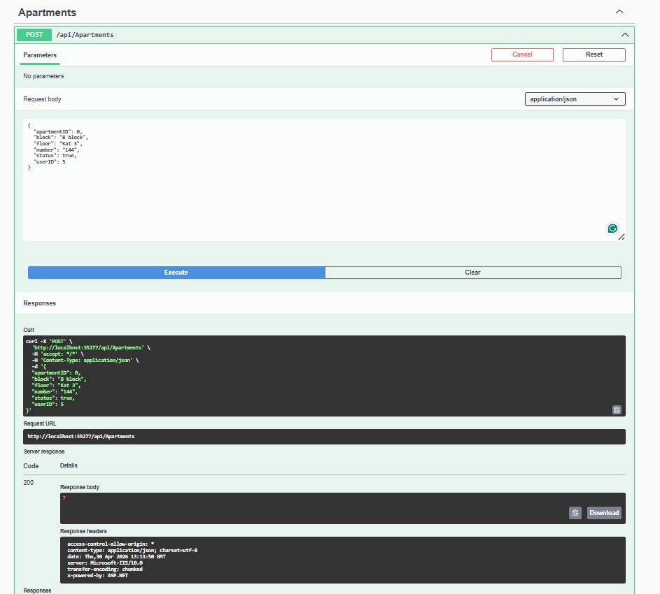
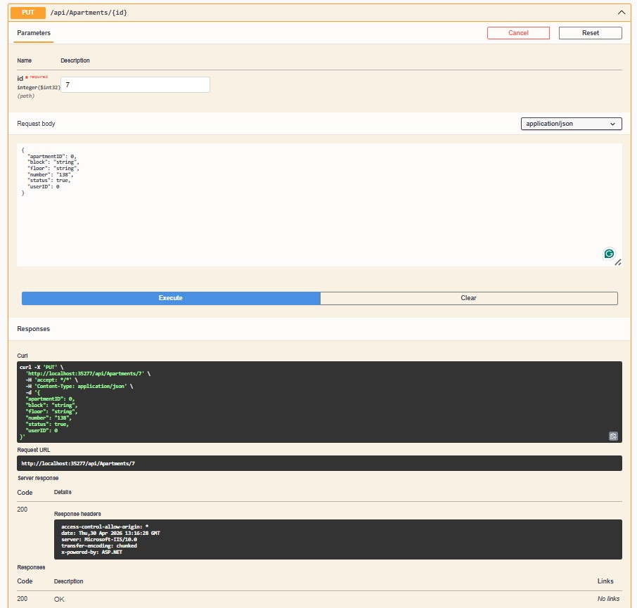
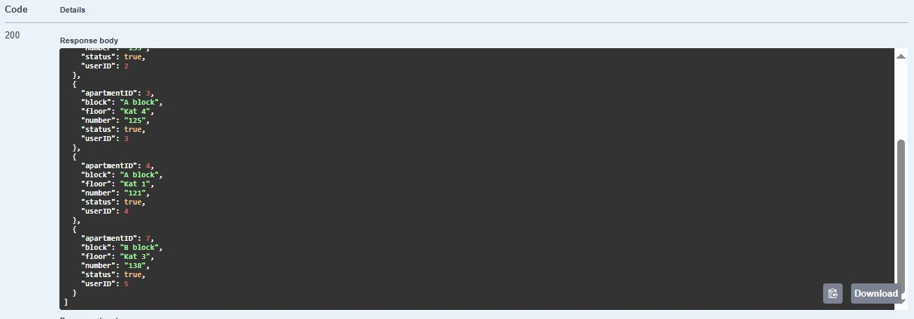

# 🏢 Apartment Management System (Apartman Yönetim Sistemi)

Bu proje, apartman ve site yönetim süreçlerini dijitalleştirmek, yönetici ve sakinler arasındaki iletişimi ve finansal takibi (aidat, fatura, mesajlaşma) kolaylaştırmak amacıyla geliştirilmiş bir **RESTful API** çözümüdür.

## 🚀 Özellikler

* **Katmanlı Mimari (N-Tier Architecture):** Core, Data, Business ve API katmanları ile modüler yapı.
* **Kullanıcı Yönetimi:** Admin (Yönetici) ve Sakin (User) rollerine dayalı yetkilendirme.
* **Daire Yönetimi:** Blok, kat ve daire bazlı detaylı takip.
* **Finansal Takip:** Aidat ve ortak kullanım faturalarının (Elektrik, Su, Doğalgaz vb.) otomatik veya manuel atanması.
* **Mesajlaşma Sistemi:** Sakinler ve yönetim arasında dahili iletişim sistemi.
* **Banka Entegrasyon Alt Yapısı:** Ödeme sistemleri için hazır şablonlar.

---

## 🛠️ Kullanılan Teknolojiler

* **Framework:** .NET Core 6.0 / 7.0
* **ORM:** Entity Framework Core
* **Veritabanı:** MS SQL Server
* **Güvenlik:** Identity Framework & JWT (JSON Web Token)
* **Dökümantasyon:** Swagger (OpenAPI)

---

## 📸 API Ekran Görüntüleri

Projenin tüm endpoint'lerini Swagger arayüzü üzerinden test edebilirsiniz. Aşağıda sistemin temel modülleri görülmektedir:

### 1. Swagger Genel Bakış
Tüm API dökümantasyonu ve endpoint listesi.

### 2. Daire ve Kullanıcı Yönetimi
Daire ekleme, silme ve sakin bilgilerini güncelleme işlemleri.

---
